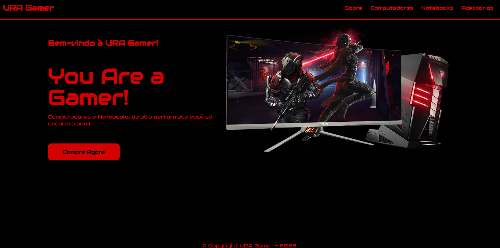

# URA Gamer

## Deploy do projeto

<https://ura-gamer.netlify.app/>

Este projeto é um site de vendas de computadores gamer de alta performance de nome fictício "URA Gamer" feito com foco no mobile-first, usando HTML, CSS e Javascript.

## Tabela de Conteúdos

- [Meu Processo de Desenvolvimento](#meu-processo-de-desenvolvimento)
- [Autor do Projeto](#autor-do-projeto)

## Meu processo de Desenvolvimento

Este projeto teve como foco produzir um site responsivo tanto para o desktop quanto para celulares, principalmente na parte mobile, no qual foi dada atenção prioritária. Para fazer o menu na versão mobile, foi usado o efeito "hamburger" para abrir e fechar uma barra de menu que fica por cima do conteúdo do site, usando Javascript em conjunto com o CSS (CSS para criar o visual do menu, tanto na versão ativado quanto na desativada, e o Javascript para fazer a função de ativar/desativar).

## Autor do Projeto

- GitHub - [Gabriel-L-Santos](https://github.com/Gabriel-L-Santos)
- LinkedIn - [Gabriel Leme dos Santos](https://www.linkedin.com/in/gabriel-leme-dos-santos/)
